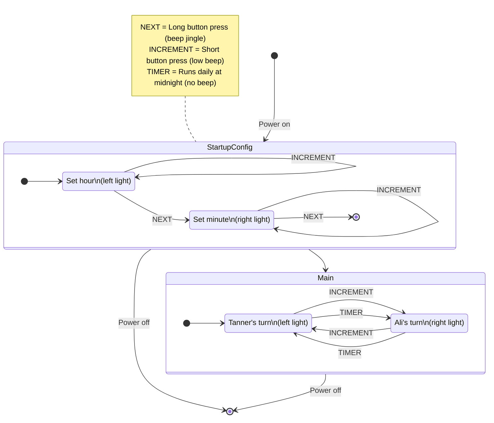

# Scoop Duty
"Scoop duty" is a small art piece that indicates whose turn it is to scoop kitty litter.  Red light means it's my day to scoop, and yellow light means it's my partner's turn to scoop.  Every day the lights automatically switch at midnight.

## Finished product
[Progress pics](#progress-pics) are at the end of this document

While the lights automatically change, the button can be used if the turn needs to be manually changed for any reason (e.g., we're out of town and order gets messed up).

## Motivation
Aside from just being a fun art piece, this device has actual, practical utility.  It's surpisingly easy to lose track of who's on scoop duty, especially since our morning routines don't overlap (and that's when we scoop).

The embarassing frequency at which we both "double scooped" or forgot to scoop (more commonly the former) was the inspiration for the project.  It's an over-engineered solution to this trivial problem.

## Behavior
The Arduino Nano can only keep track of how much time has passed since it powered on, so it needs to be told what time it is upon startup (in order to know when midnight is). After the time is configured, the turn indicator lights will change daily, at midnight.

# Make your own
This repository has everything you need to make your own "scoop duty" frame if you'd like!

We used an [Arduino Nano](https://store-usa.arduino.cc/products/arduino-nano?selectedStore=us) but any Arduino board should work.  Aside from that, the only special components you'll need are LEDs, a Piezo (beeper), and some 330Ω resistors (one for each LED), and a button switch.

How you build the rest is up to you, but this is what we used:
- shadow box frame from a local arts & crafts store along with
- veneer to carve the cat outlines into
- parchment paper to diffuse the LED lighting
- a chunk of wood from the frame itself to divide the inside of the box and prevent the light from bleeding to the opposite side
- lots of hot glue and solder to put it all together

## Source Code
You're welcome to use the source code for this project in any way you'd like: [scoop_duty/scoop_duty.ino](./scoop_duty/scoop_duty.ino).  If you're not keen on programming, this will probably save you some time.

The code assumes the following schematic, but it can easily be adapted if you wire up your project differently.

## Schematic

### Legend
| Shape | Description |
| - | - |
| Rectangle | Arduino Pin |
| Line | Wire |
| Circle | IO element |
| Hexagon | Resistor |

# Progress pics
Initial sketch

Breadboard prototype

Button and (custom) power socket inserted into the frame

Rough layout of the LEDs and initial soldering

Wiring it all together

Cat tax

