# Scoop Duty
"Scoop duty" is a small art piece that indicates whose turn it is to scoop kitty litter, based on the current time.  It uses an [Arduino Nano](https://store-usa.arduino.cc/collections/boards/products/arduino-nano) control the LEDs and handle external input.

TODO: add demo gif

## Behavior
The Arduino Nano can only keep track of how much time has passed since it powered on, so it needs to be told what time it is upon startup.

After the time is configured, the turn indicator lights will change daily, at midnight.  The external button can be used if the turn needs to be manually changed for any reason (e.g., both of us are out of town for an odd number of days).

## Schematic

```mermaid
flowchart LR
Pin2 ---|+| Piezo((Piezo)) ---|-| GND
Pin3-6,8-11 ---|+| LED((LED)) ---|-| R1{{330Ω}} --- GND
Pin12 --- Button((Button)) --- GND
```

### Legend
| Shape | Description |
| - | - |
| Rectangle | Arduino Pin |
| Line | Wire |
| Circle | IO element |
| Hexagon | Resistor |
